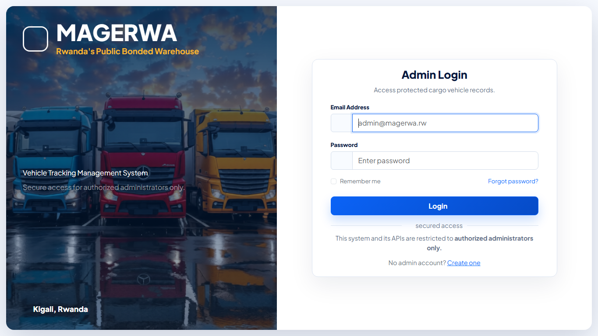
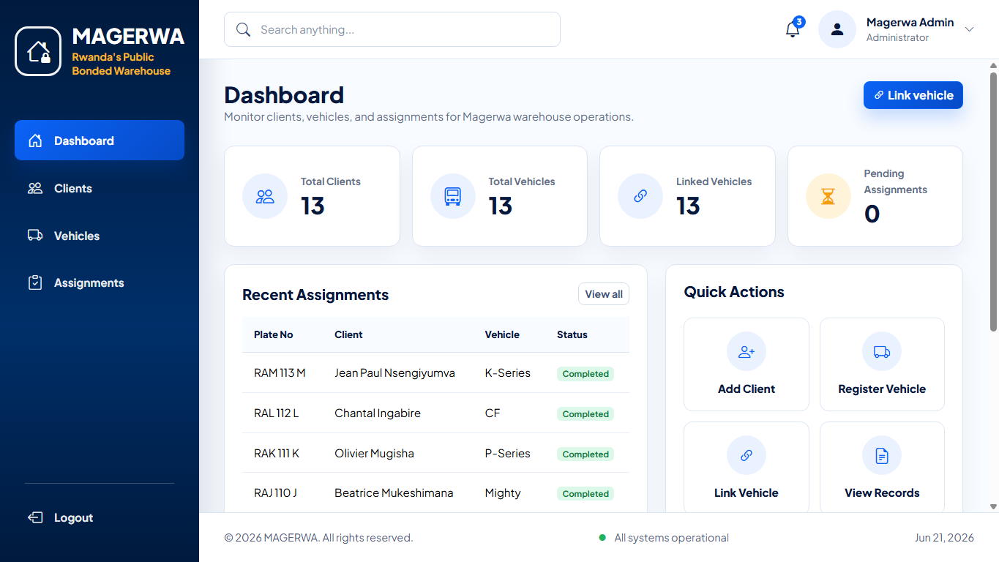
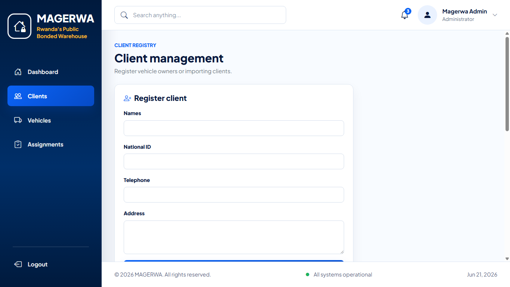
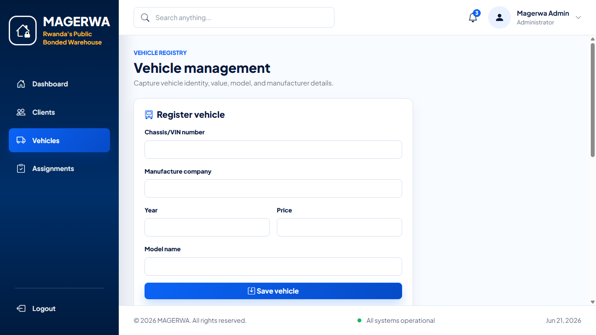
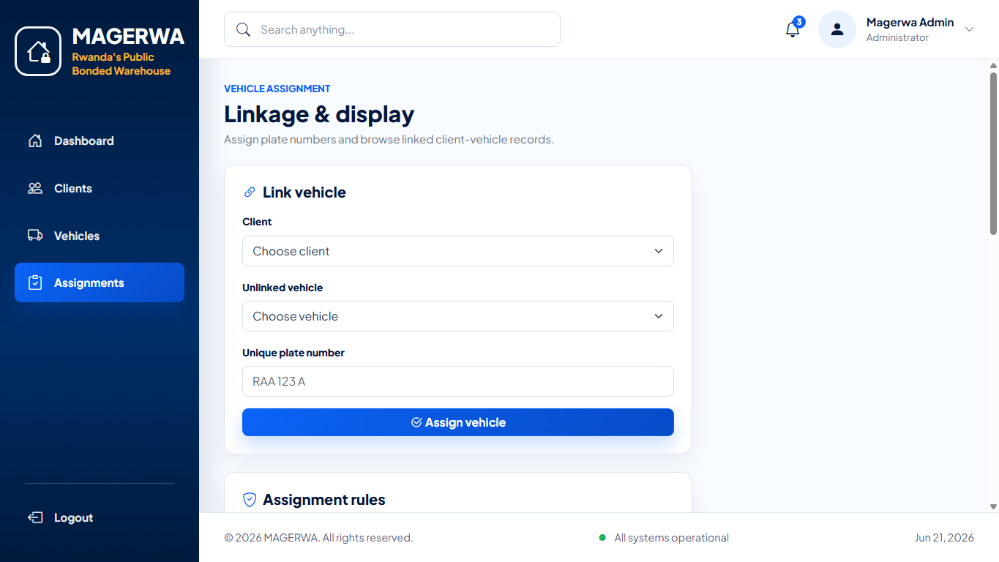

# 🚛 MAGERWA Vehicle Tracking Management System

A modern web-based vehicle tracking and client management system developed for **MAGERWA (Magasins Généraux du Rwanda)**, Rwanda's Public Bonded Warehouse.

The platform enables administrators to securely manage clients, register vehicles, assign vehicles using unique plate numbers, and monitor vehicle ownership records through a responsive dashboard.

---

## 📸 Project Screenshots

### Login Page



### Dashboard



### Client Management



### Vehicle Management



### Vehicle Assignments



---

## 📋 Table of Contents

* Overview
* Features
* Technology Stack
* System Architecture
* Database Design
* Installation
* Usage
* API Documentation
* Validation Rules
* Security Features
* Folder Structure
* Future Improvements
* Author

---

# Overview

The MAGERWA Vehicle Tracking Management System was developed to digitize vehicle registration and client ownership management processes.

The system allows administrators to:

* Register and manage clients
* Register and manage vehicles
* Link vehicles to clients
* Maintain ownership records
* Access protected API endpoints
* Track vehicle assignments using unique plate numbers

---

# ✨ Features

## Authentication

* Secure admin registration
* Secure login and logout
* Session-based authentication
* Protected routes
* Protected API endpoints

## Client Management

* Create clients
* View clients
* Update client information
* Delete clients

## Vehicle Management

* Register vehicles
* Update vehicle details
* Delete vehicles
* Manage vehicle inventory

## Vehicle Assignment

* Link vehicles to clients
* Unique plate number assignment
* Edit assignments
* Remove assignments

## Records Management

* Paginated records display
* Vehicle-client relationship tracking
* Quick lookup and monitoring

## User Experience

* Responsive design
* Bootstrap dashboard
* Auto-dismiss alerts
* Modal confirmations
* Mobile-friendly layout

---

# 🛠 Technology Stack

| Layer          | Technology          |
| -------------- | ------------------- |
| Frontend       | HTML5               |
| Styling        | CSS3                |
| UI Framework   | Bootstrap 5         |
| Icons          | Bootstrap Icons     |
| Backend        | PHP 8               |
| Database       | MySQL / MariaDB     |
| Authentication | PHP Sessions        |
| API            | JSON REST-style API |
| Server         | Apache              |

---

# 🏗 System Architecture

```text
+------------------+
|     Browser      |
+------------------+
         |
         v
+------------------+
|   PHP Backend    |
+------------------+
         |
         v
+------------------+
| MySQL Database   |
+------------------+
```

The application follows a simple three-layer architecture:

1. Presentation Layer (Frontend)
2. Business Logic Layer (PHP)
3. Data Layer (MySQL)

---

# 🗄 Database Entities

## Admins

Stores administrator accounts.

## Clients

Stores customer information.

## Vehicles

Stores vehicle details.

## Vehicle Assignments

Stores relationships between vehicles and clients.

---

# 📂 Project Structure

```text
Magerwa/
│
├── assets/
│   ├── css/
│   │   └── style.css
│   └── magerwa-trucks-login.png
│
├── includes/
│   ├── header.php
│   └── footer.php
│
├── api.php
├── auth.php
├── clients.php
├── config.php
├── index.php
├── link_vehicle.php
├── login.php
├── logout.php
├── schema.sql
├── signup.php
├── vehicles.php
└── README.md
```

---

# ⚙ Requirements

* PHP 8.0+
* MySQL 5.7+
* MariaDB 10+
* Apache Web Server
* XAMPP / WAMP / Laragon
* Modern Browser

---

# 🚀 Installation

## 1. Clone the Repository

```bash
git clone https://github.com/krif014/Magerwa-vehicle-tracking-system.git
```

or copy the project folder into:

```text
C:\xampp\htdocs\magerwa
```

---

## 2. Start Services

Open XAMPP and start:

* Apache
* MySQL

---

## 3. Import Database

Open:

```text
http://localhost/phpmyadmin
```

Create a database named:

```sql
magerwa_vehicle_tracking
```

Import:

```text
schema.sql
```

---

## 4. Configure Database Connection

Edit `config.php`

```php
const DB_HOST = '127.0.0.1';
const DB_NAME = 'magerwa_vehicle_tracking';
const DB_USER = 'root';
const DB_PASS = '';
```

---

## 5. Launch Application

```text
http://localhost/magerwa/login.php
```

---

# 🔑 Test Account

```text
Email: admin@magerwa.rw
Password: Admin12345
```

If unavailable, create a new admin account:

```text
/signup.php
```

---

# 📡 API Documentation

## Authentication

### Login

```http
POST /api.php?action=login
```

Request:

```json
{
  "email":"admin@magerwa.rw",
  "password":"Admin12345"
}
```

---

## Client Endpoints

```http
GET    /api.php?action=clients
POST   /api.php?action=clients
PUT    /api.php?action=clients
DELETE /api.php?action=clients&id=1
```

---

## Vehicle Endpoints

```http
GET    /api.php?action=vehicles
POST   /api.php?action=vehicles
PUT    /api.php?action=vehicles
DELETE /api.php?action=vehicles&id=1
```

---

## Assignment Endpoints

```http
GET    /api.php?action=records&page=1&per_page=10
POST   /api.php?action=links
PUT    /api.php?action=links
DELETE /api.php?action=links&id=1
```

---

# ✅ Validation Rules

### Admin

* Valid email required
* Strong password required

### Client

* Valid telephone number
* National ID validation

### Vehicle

* Unique chassis number
* Valid manufacture year
* Positive vehicle price

### Assignment

* Unique plate number
* Existing client required
* Existing vehicle required

---

# 🔒 Security Features

* Password hashing
* Session authentication
* Route protection
* API protection
* Input validation
* SQL injection prevention using prepared statements
* Server-side validation
* Client-side validation

---

# 📈 Future Improvements

* Vehicle search and filtering
* Vehicle history tracking
* Export reports to PDF
* CSV exports
* Admin roles and permissions
* Dashboard analytics
* Real-time vehicle monitoring
* Email notifications
* Audit logs

---

# 🧪 Testing

The system has been tested for:

* Authentication workflows
* CRUD operations
* Vehicle assignments
* API functionality
* Session protection
* Responsive layouts

---

# 👨‍💻 Author

**UWIMANA Krif**

Software Developer

Built as an academic and practical management system project for MAGERWA Rwanda.

---

# 📄 License

This project is provided for educational and demonstration purposes.

© 2026 UWIMANA Krif
